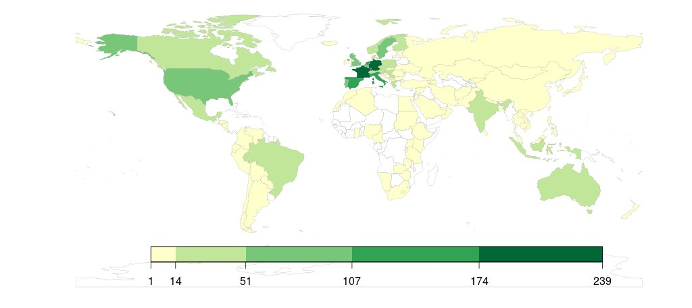
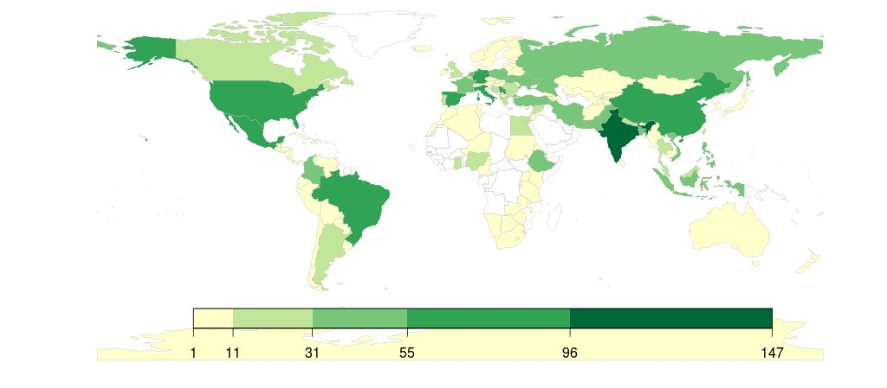
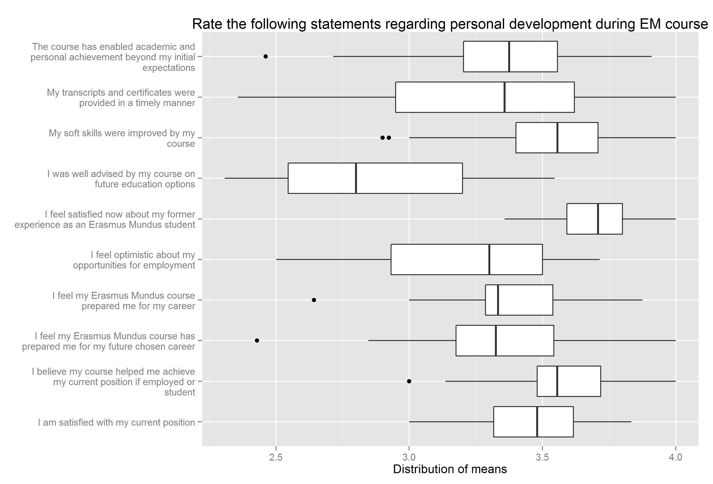
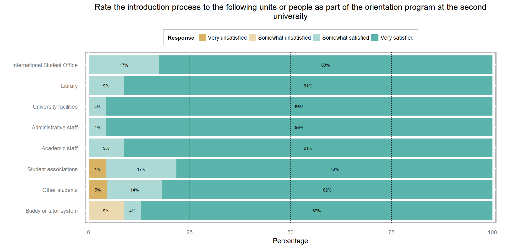
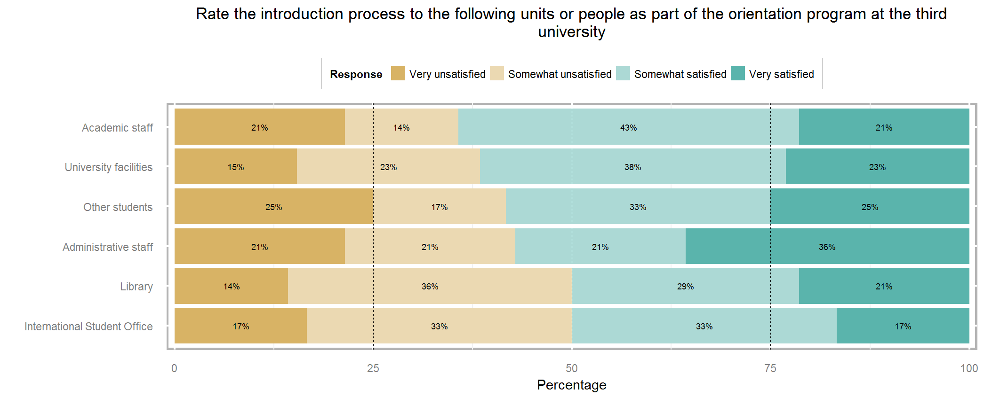
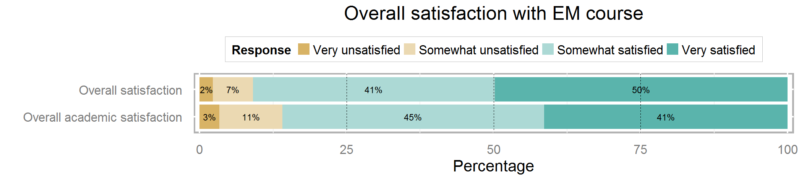

## Demographics

2131 respondents from 128 countries and 193 courses.
- 977 females (46%) and 1135 males (54%).
- 1674 (79%) with scholarship and 457 (21%) without.
- 71 course with 10 or more respondents.

--- 

## IP-addresses of respondents

---

## Nationalities of respondents

--- .segue bg:grey

## How can you use this data?

---

## Policy

*** =pnotes

- Easy to see problematic areas.
- like this list

--- 

## Consortium

<table border = 1>
<caption align="bottom"> Example of a summary table </caption>
<tr> <th rowspan = "2" style="text-align:center">Course X</th><th rowspan="2">n</th><th rowspan="2">Mean</th><th rowspan="2" style="text-align:center">Mean for all EMJMD courses</th><th colspan="5" style="text-align:center"> Quartile distribution of means for all EMJMD </th>
</tr>
<tr><th>0%</th><th>25%</th><th>50%</th><th>75%</th><th>100%</th></tr>

  <tr> <td> Course content </td> <td align="center"> 23 </td> <td align="center"> 3.35 </td> <td style="text-align:center"> 3.19 </td> <td> 2.54 </td> <td> 3.03 </td> <td> 3.23 </td> <td> 3.38 </td> <td> 3.70 </td> </tr>
  <tr> <td> Enrolling in classes </td> <td align="center"> 23 </td> <td align="center"> 3.65 </td> <td style="text-align:center"> 3.42 </td> <td> 2.57 </td> <td> 3.25 </td> <td> 3.44 </td> <td> 3.62 </td> <td> 3.92 </td> </tr>
  <tr> <td> Evaluation methods </td> <td align="center"> 23 </td> <td align="center"> 3.18 </td> <td style="text-align:center"> 3.03 </td> <td> 2.23 </td> <td> 2.88 </td> <td> 3.06 </td> <td> 3.22 </td> <td> 3.76 </td> </tr>
  <tr> <td> Information about fieldwork </td> <td align="center"> 23 </td> <td align="center"> 3.09 </td> <td style="text-align:center"> 2.95 </td> <td> 2.00 </td> <td> 2.80 </td> <td> 3.00 </td> <td> 3.18 </td> <td> 3.57 </td> </tr>
  <tr> <td> Standards of behavior </td> <td align="center"> 23 </td> <td align="center"> 3.64 </td> <td style="text-align:center"> 3.44 </td> <td> 2.77 </td> <td> 3.28 </td> <td> 3.42 </td> <td> 3.63 </td> <td> 3.90 </td> </tr>
  <tr> <td> Timetable </td> <td align="center"> 23 </td> <td align="center"> 3.30 </td> <td style="text-align:center"> 3.13 </td> <td> 1.75 </td> <td> 2.99 </td> <td> 3.20 </td> <td> 3.33 </td> <td> 3.80 </td> </tr>
   </table>

*** =pnotes

- Not a ranking
- More like putting each course in a respective bin.
- However, other measures should be used in conjunction with this information.

--- {tpl: twocolumns}

## Individual university

*** =left

*** =right

*** =pnotes

- Students are from the same program.
- There is definitely room for improvement.
- Publishing online.

---

## Students

1. Accountability.
2. Transparency.
3. Future choice.

*** =pnotes

For example, students might look at their prospective courses and see what services are lacking to be aware of that situation in advance.

---

## Overall satisfaction

*** =pnotes

- overall students are satisfied with their courses.

