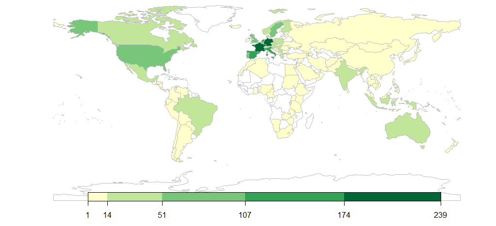
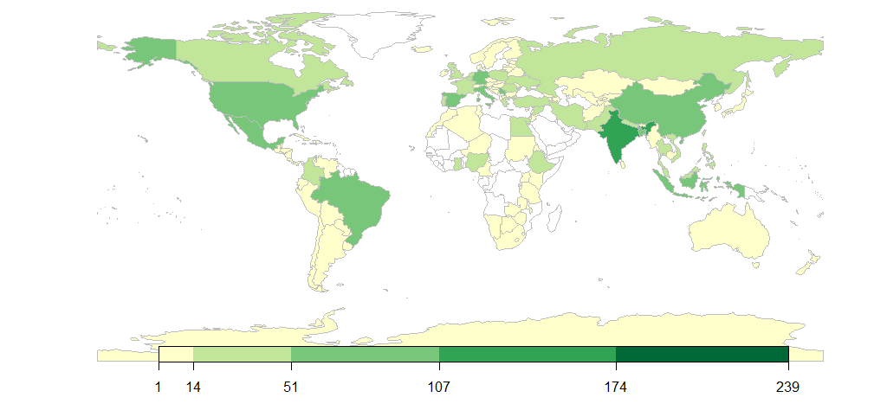

Quantitative results of CQSS
========================================================
author: Mikhail Balyasin
date: 09-Oct-2015

Demographics
========================================================
2131 respondents from 128 countries and 193 courses.
- 977 females (46%) and 1135 males (54%).
- 1674 (79%) with scholarship and 457 (21%) without.
- 71 course with 10 or more respondents.

Geographic distribution
========================================================

***

Slide With Plot
========================================================

 
